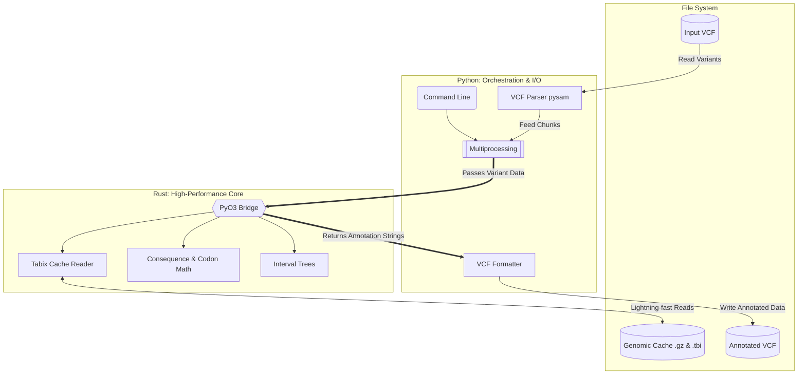

# ensembl-vep

|**Build Status**|**License**|
|:--------------:|:---------:|
| <a href="https://github.com/jeffersonfparil/ensembl-vep/actions"></a> | [](https://www.apache.org/licenses/LICENSE-2.0) |

A draft re-implementation using a Rust-Python hybrid approach

```shell
ensemble-vep/
├── Cargo.toml             # Rust dependencies (pyo3, noodles, rayon)
├── pyproject.toml         # Python build config (maturin)
├── src/                # RUST CORE
│   ├── lib.rs             # PyO3 module bindings
│   ├── cache.rs           # Local caching/query/parsing (noodles)
│   ├── consequences.rs    # Sequence ontology term calculation (codon math)
│   └── intervals.rs       # Fast interval trees (rust-lapper)
├── vep_pyrs/           # PYTHON ORCHESTRATOR
│   ├── __init__.py
│   ├── cache_manager.py   # Caching
│   ├── parallel_runner.py # Multiprocessing and chunking
│   ├── writer.py          # VCF formatting and writing
│   └── cli.py             # CLI
├── tests/              # TESTS
│   ├── test_rust_core.py  # Test Rust components
│   ├── test_caching.py    # Test caching
│   ├── test_io.py         # Test IO
│   └── test_cli.py        # Test CLI
└── examples/           # EXAMPLES FOR TESTS
```



Dev stuff:

```shell
cargo install uv

cd ensembl-vep

uv sync # installs maturin, pytest, etc
uv tool run maturin develop # use maturin as a standalone tool to develop the package including Rust library compilation
uv run pytest tests/ -v # use pytest as part of the whole python project


```